layout: true

---

# Зачем изучать статистику?

.center[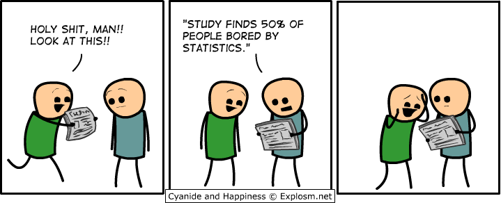]

--

###.center[Чтобы отвечать на интересные вопросы с помощью данных!]


---

background-image: url(./img/SampleSpace.svg)
background-size: cover
class: center

---

# Генеральная совокупность
### Множество всех пациентов на Земле, которые больны раком крови

.pull-left[

# Примеры выборок
### > Случайно выбрали 1% больных
### > Все больные в случайной больнице
### > Случайно выбираем по 100 больных из каждой группы крови
### > Все больные люди старше 80 лет

]
.pull-right[

.middle[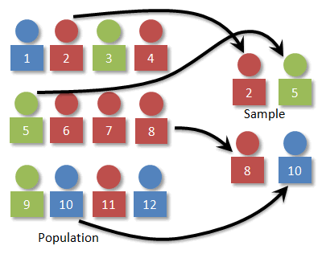]

]

---

# Не все выборки одинаково полезные!

### Репрезентативная выборка = хорошая выборка, которая отражает свойства ГС

.center[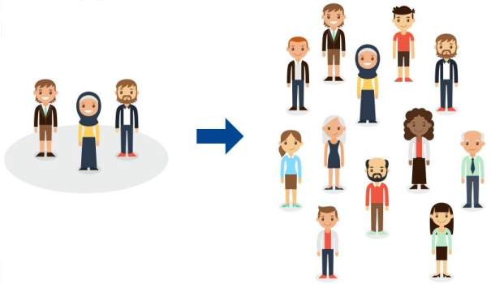]

---

background-image: url(./img/GarbageInOut.svg)
background-size: cover
class: center

---

# Хотим измерить среднюю скорость бега 

.pull-left[
### Какие из этих выборок репрезентативные?
### > друзья, одногруппники, коллеги 
### > откликнувшиеся на объявление в вк
### > случайные люди из телефонной книги
]
.pull-right[

]

---

# Как получать данные?

### Планирование эксперимента - (важная!) наука о том, как правильно получать выборки


## Выборки бывают
###     > Зависимые (оценки школьников по алгебре и русскому)
###     > Независимые (прододжительность жизни здоровых и больных мышей)

--

## Алгоритмы построения выборок бывают:
###     > Детерменированные - purposive, convinience, snow-ball, quota sampling
###     > Вероятностные - simple random, stratified random, cluster, multi-stage sampling

---

# Вероятностные выборки. Где какая?
.top[.pull-left[
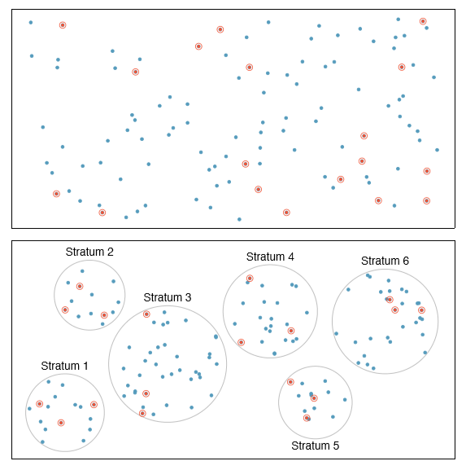
]
.pull-right[
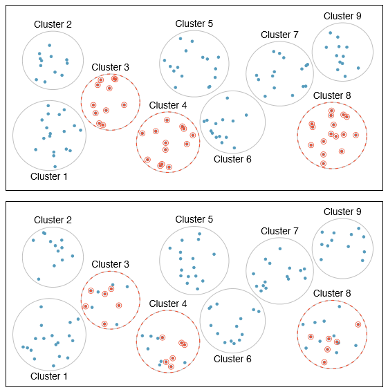
]]

---
class: center, middle

#Даже самый хитрый вероятностный  алгоритм не 
#гарантирует, что выборка будет репрезентативна!

---

.pull-left[
# Загадка: выборы в США

### В 1936 журнал Literary Digest  разослали 10млн пробных бюллетеней своим подписчикам и случайным людям из телефонного справочника. Оказалось, что

### > 57% за республиканца Лэндона
### > 40% за демократа Рузвельта

### Однако победил Рузвельт. 

### Где ошибка?
]

.pull-right[
.middle[]
]

---

.pull-left[
# Разгадка: выборы в США

### Выборка была не репрезентативна!

### > Большинство подписчиков были республиканцы

### > "Рандомные" люди не были рандомными, так как телефонами обладали средний и высший класс (опять республиканцы)
]

.pull-right[
.middle[]
]

---

class: center, middle

# Ок, я выбрал алгоритм семплирования
# Сколько мне нужно данных для исследования?


---

.pull-left[
# Сколько нужно данных?
### > чем больше, тем лучше 
### > 30
### > n = $available / $sample
]
.pull-right[

]

<br>

### Иногда необходимый объем выборки можно оценить из мощности теста
### Чем меньше объем выборки, тем менее статистически надежными будут результаты
### Однако с очень большими выборками тоже могут возникнуть проблемы

---

background-image: url(./img/Batch.png)
background-size: contain

# Не забывайте про  batch-effect!

---

# Take-home message

### > хорошая выборка должна отражать свойста ГС
### > сделать репрезентативную выборку сложно (но нужно стараться)
### > качество данных влияет на качество дальнейших исследований
### > размер выборки важен
### > batch-effect


---

class: center, middle

# Ок, у меня есть данные, что дальше?
# Анализировать их!

---
# Виды статистического анализа 

### > Описательная статистика
### > Поиск различий (проверка гипотез) в данных (одна или несколько групп)
### > Поиск зависимостей
### > Поиск "смысла" в данных (кластеризация)
### > ...

---

# Где можно анализировать данных? Например, в R

.center[]

<br>
### Замечание 1: статистический анализ можно делать в Excel или Google Spreadsheets
### Замечание 2: можно и в Python
### Замечание 3: можно на любом языке, но в R удобнее 

---

.pull-left[
# За что мы любим R

### > все реализовано за нас
### > свободный код
]

--

.pull-right[
# За что мы не любим R

### > немаленький порог вхождения 
### > относительная медлительность*

<br><br>

###*особенно, если плохо написать код
]


---

# Как попросить помощь у R?

```{r}
?histogram
??histogram
?hist
```

### Также удобно нажимать на tab, чтобы R-studia подсказывала название и аргументы функций

---

# Вспомним основные статистические концепты

.center[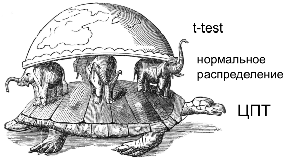]

---

# Среднее и медиана

```{r}
set.seed(42)
v <- sample(1:100, 10)
print(v)

mean(v)

median(v)
```

### Упражнение: Добавьте в вектор число 1000. Как изменится среднее и медиана?

---
# Упражнение: решение

```{r}
v <- c(v, 1000)

mean(v)

median(v)
```

### > Медиана устойчива к выбросам (аутлаерам)
### > Среднее чувствительно к выбросам

---

# Дисперсия и стандартное отклонение (std)

.pull-left[
### Дисперсия = среднеквадр-е отклонение от среднего
### Cтандартное отклонение = корень из дисперсии
.center[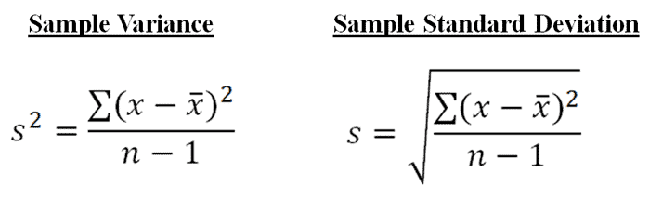]
]
.pull-right[
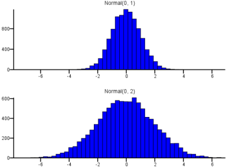
]


---

# Среднее и дисперсия не полностью описывают данные

.center[]

---

# Ящик с усами (boxplot)

.center[]

---

# Ящик с усами 

.center[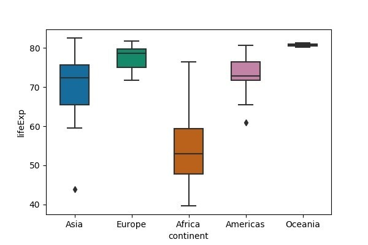]

### Вы видите какие-то проблемы?

---

# Ящик с усами коварный!

.center[]

---

# Ящик с усами коварный! Можно смотреть на Violinplot

.center[]

---

# Ящик с усами можно улучшить точечками 

.center[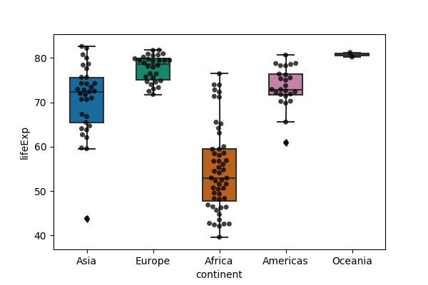]

---

class: top

.center[]

.pull-left[
### > 90% всех наблюдений: m +- s
### > 95% всех наблюдений: m +- 1.96s
]
.pull-right[
### > 99.73% наблюдений: m +- 3s
### (правило трех сигм)
]

---

# Центральная Предельная Теорема (ЦПТ)

### Неправильные формулировки:
### > В природе все распределено нормально
### > Если долго семплировать выборки из какого-то распределения, то получится нормальное распредение

---
# Центральная Предельная Теорема

### > ЦПТ - это утверждение про распределение средних!
### (Среднее распределено примерно как N(mu, sigma^2/n))

https://gallery.shinyapps.io/CLT_mean/

### > ЦПТ работает если n > 30

### > ЦПТ лежит в основе доверительных интервалов

---

.pull-left[
```{r plot-last, fig.show = 'hide'}
library(ggplot2)

# число повторений
r <- 1000

# объем одной выборки
n <- 10

x <- replicate(r, runif(n))
mean_x <- apply(x, 2, mean)
mean_x <- data.frame(sample_mean = mean_x)

ggplot(mean_x) + 
  geom_histogram(aes(x = sample_mean)) +
  xlab("Sample mean") +
  theme_bw()
```

### Упр: а что если увеличить n?
]

.pull-right[
```{r ref.label = 'plot-last', echo = FALSE, fig.retina = 3}
```
]


---

# Проверка гипотез

## > Гипотеза - утверждение про генеральную совокупность 
##(не про выборку!!!)

## > Нулевая гипотеза - различий нет

## > Альтернативная гипотеза - различия есть

---

#Тесты всегда ошибаются!

.center[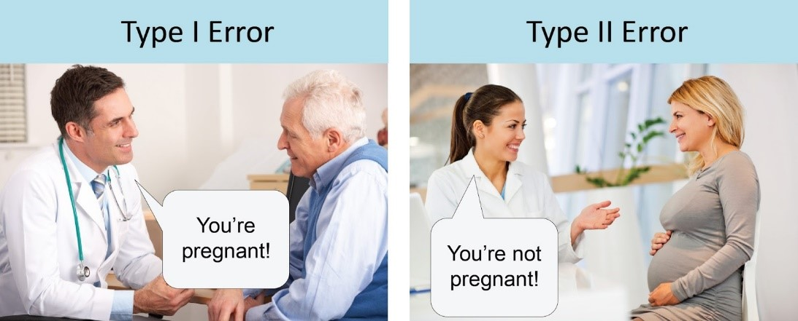]

---

# Уровень значимости

## Должны построить тест так, чтобы

## 0.05 = P(случайно отклонить нулевую гипотезу) 
## 0.05 = P(случайно сделать открытие, когда ничего нет)
## 0.05 = P(ошибки I рода)

<br>

## Почему 0.05? Так сложилось

---

# Нельзя говорить "принимаем альтернативу"!!!

## Посчитать вероятность ошибки второго рода сложно
## Никто не гарантирует, что она маленькая

---

class: center, middle

# Задача

## Подкинули монетку 10 раз
## Как понять, что монетка правильная?

---

```{r}

n <- 10
r <- 1000
x <- replicate(r, sample(0:1, n, replace = T))
TailsDistr <- apply(x, 2, sum)

```

---

```{r}
ggplot(data.frame(n_tails = TailsDistr)) + 
  geom_histogram(aes(x = n_tails)) +
  xlab("Tails distribution") +
  theme_bw()
```


---

# P-value

## P-value = вероятность получить такое же или более экстремальное значение статистики при условии, что нулевая гипотеза верна

.center[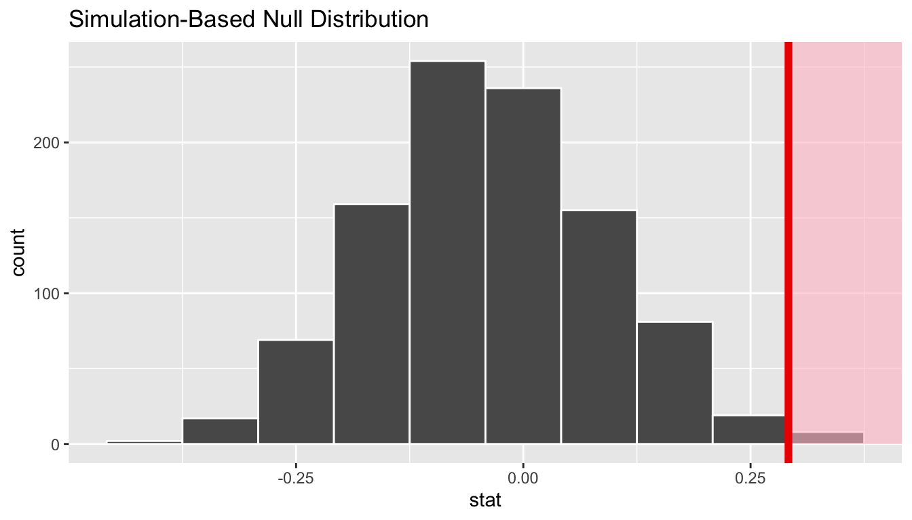]

---

# Одновыборочный t-test в R

```{r}
?t.test
```

---

# Одновыборочный t-test в R

```{r}

x <- rnorm(n = 100, mean = 0, sd = 1)

t.test(x, mu = 0)

```

---

# Одновыборочный t-test в R

```{r}

t.test(x, mu = -1000)

```

---

# t-test требует

### > Независимость наблюдений
### > При маленьком объеме выборки велика ошибка второго рода (маленькая мощность)
### > Если маленький объем выборки, то распределение признака должно быть нормальным


---


# Двувыборочный t-test в R

```{r}

x <- rnorm(n = 100, mean = 0, sd = 1)
y <- rnorm(n = 80, mean = 10, sd = 1)

t.test(x, y)

```

---
# P-value Quiz

### > Если в исследовании p = 0.001, то вероятность того, что верна нулевая гипотеза (новый препарат не влияет на скорость выздоровления) также равняется 0.001.
### > Если в исследовании p = 0.9, это означает, что верна нулевая гипотеза, и новый препарат не влияет на скорость выздоровления
### > Чем меньше p-value, тем сильнее получаемые различия
### > Вероятность случайно получить такие различия, при условии что на самом деле верна нулевая гипотеза, равняется 0.005.

---

# Take-home message

### > ЦПТ работает для больших выборок (> 30)
### > статистические тесты должны ошибаться
### > нельзя говорить "принимаем альтернативную гипотезу"
### > p-value не магическое число


---

# Как мне изучать статистику самостоятельно?

## > Что смотреть?

###Рекомендую начать с курсов Анатолия Карпова на Stepik :)

## > Что читать?

### Книжка по медгенетике (TBD)
### https://www.nature.com/collections/qghhqm

## > Как практиковаться?

### Анализировать датасеты на Kaggle, читать обсуждения


---

class: center, middle

# Спасибо за внимание! Теперь вы крутые статистики

---

class: center, middle

# Не все так просто
# Многие биологические статьи не воспроизводятся из-за плохого статистического анализа

---

# История 1: Симпсон 

.center[]

---
# Загружаем данные

```{r}
df <-read.table("Neuroticism.csv")
head(df)
summary(df)
```

---

```{r, fig.retina = 3}
ggplot(data=df, aes(Neuroticism, Salary)) +
  geom_point() + 
  geom_smooth(method = 'lm') + 
  theme_bw()
```


---

```{r, fig.retina = 3}
ggplot(data=df, aes(Neuroticism, Salary)) +
  geom_point(aes(col = Education)) + 
  theme_bw()
```


---

```{r, fig.retina = 3}
ggplot(data=df, aes(Neuroticism, Salary)) +
  geom_point(aes(col = Education)) + 
  geom_smooth(aes(col = Education), method = 'lm') +
  theme_bw()

```

---

```{r, fig.retina = 3}
ggplot(data=df, aes(Neuroticism, Salary)) +
  geom_point(aes(col = Sex)) + 
  theme_bw()
```

---

# Парадокс Симпсона 

.center[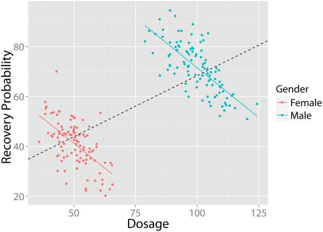]

### Обязательно смотрите на данные и раскрашивайте их по категориальным переменным!

---

# История 2: про мракобесие
.center[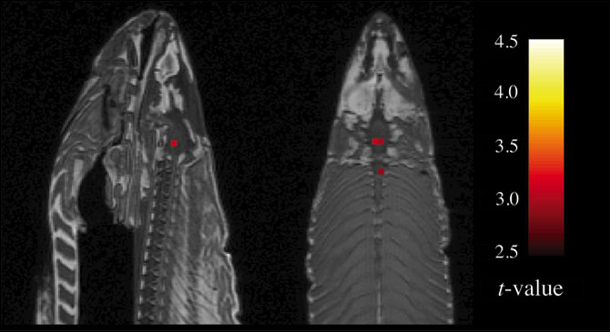]

---

# GWAS и автомобильные аварии

## Попробуем найти SNP, который предсказывает твои шансы умереть в автокатастрофе 

---
# Множественное тестирование

.center[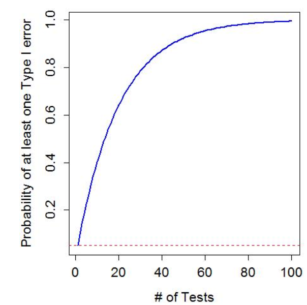]

---

# ANOVA

## > Тестируем три лекарства, хотим найти самое эффективное
## > Что если хотим сравнить каждое среднее с каждым?

---

# Take-home message

## > перед любым статистическом анализом обязательно смотрим на данные (EDA)
## > в данных могут быть неоднородности и аутлаеры, которые могут изменить результат анализа
## > поправка на множественное тестирование!!!
## > если исследуете несколько групп, то используйте специальные тесты (ANOVA) 

---

class: center, middle

# Q&A


